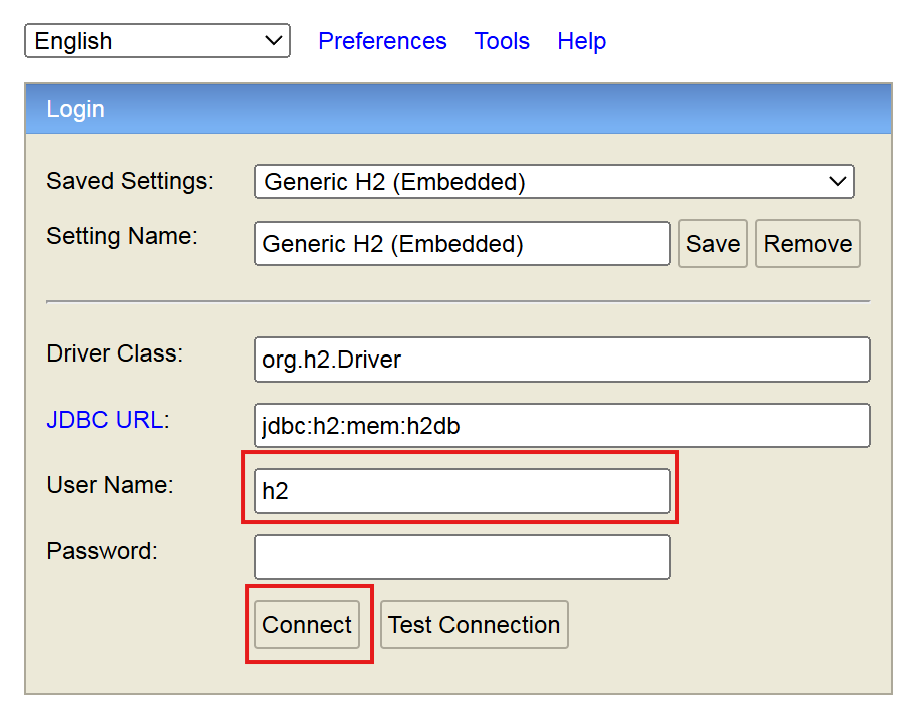
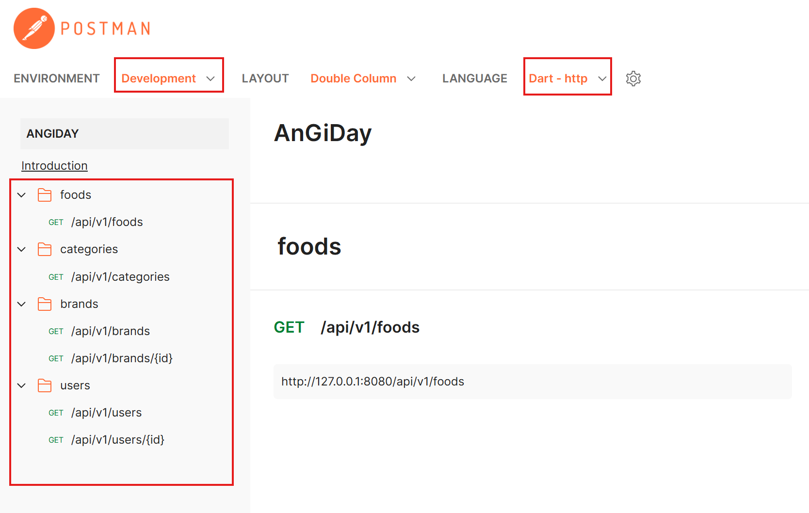
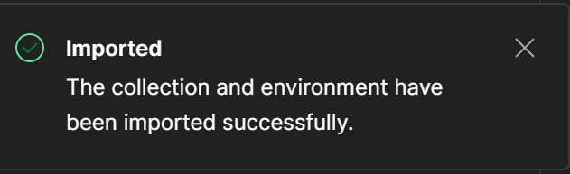

## 1 Installation Guide
### 1.1 Prerequisites:
- Java (JDK17)
- IntelliJ (or Eclipse)
- Postman (for testing API)
### 1.2 Clone repository
``` bash
git clone https://github.com/an-gi-day/an_gi_day_backend
cd an_gi_day_backend
```

### 1.3 Run Project
1. Open the Project
2. Sync Gradle Project
3. Run `SpringBootApplication` (`AnGiDay` class)
4. Now the server is running at: http://127.0.0.1:8080

### 1.4 H2 Database
1. Access the H2 database at: http://127.0.0.1:8080/h2-console
2. The username is `h2` and the password is empty by default
3. Click `Connect`

> **Note**: The initial database schema is located at `/src/main/resources/data.sql`

## 2 API Document
I have published a Postman documentation. You can view it here: https://documenter.getpostman.com/view/43499672/2sB3dK1DBc

### How to use the Document
1. Access the Postman documentation page.
2. Switch the Environment to `Development`
3. Switch the language to `Dart - http` (for integrating APIs with the AnGiDay Flutter App)
4. In the API folders on the left sidebar, find and open the API folder you want.
5. Then you can see all the endpoints inside it and click on it to see the example and description.


### How to run in Postman
1. Click the button 
2. Choose Run in `Postman for Web`
3. Then choose a workspace to import into (if you don't have, create it first)
4. Postman will notify you if the import is successful.

